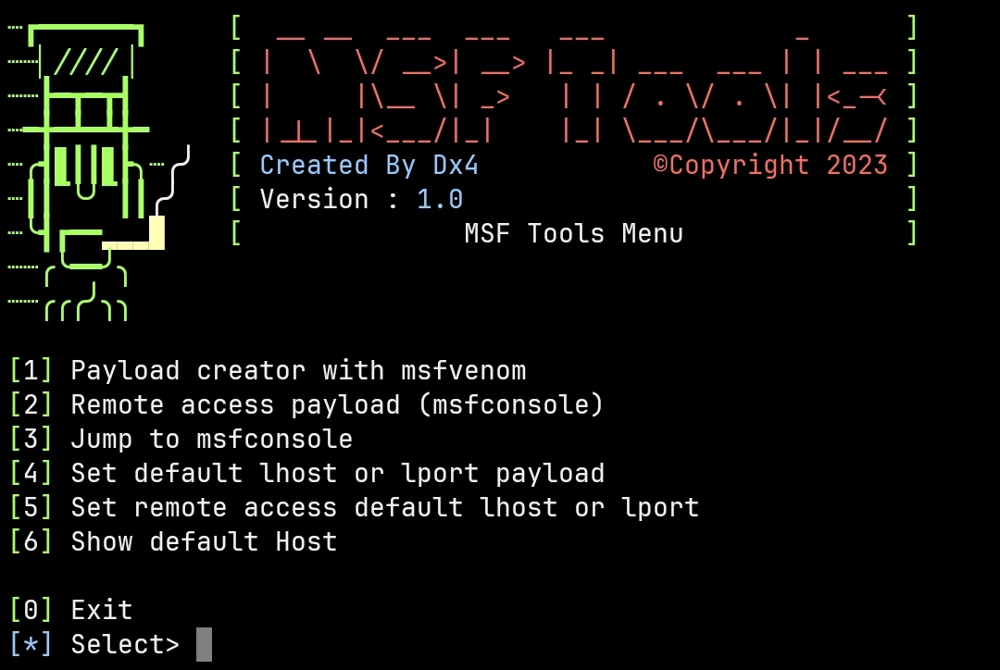

# Metasploit Tools

Metasploit Tools is a collection of scripts to streamline Metasploit Framework-related tasks, including payload generation and remote access payloads. These tools are designed to simplify the Metasploit workflow and enhance your experience.



## Features

- Payload generation with `msfvenom` and templates.
- Easy setup of remote access payloads.
- Integration with the Metasploit Framework.

## Installation

To install Metasploit Tools, follow these steps:

1. Open your terminal (in this example, we're using Termux on Android).

2. Clone this repository:
   ```bash
   git clone https://github.com/DX4GREY/metasploit-tools.git
   cd metasploit-tools
   ```

3. Make sure the `build.sh` script is executable:
   ```bash
   chmod +x build.sh
   ```

4. Run the `build.sh` script to set up Metasploit Framework on your system (Note: You might need superuser or root permissions on some systems):

   ```bash
   ./build.sh
   ```

5. Follow the prompts to complete the installation.

6. Once the installation is finished, you can access the tools by running:

   ```bash
   msftools
   ```

7. Enjoy using Metasploit Tools for various tasks related to the Metasploit Framework!

## Usage

1. After installation, you can run `msftools` to access the main menu of Metasploit Tools.

2. Follow the on-screen instructions to use the different features, such as payload generation, setting default hosts, and launching the Metasploit Framework.

## Uninstallation

To uninstall Metasploit Tools:

1. Open your terminal.

2. Navigate to the Metasploit Tools directory (where you cloned the repository).

3. Run the following command (you might need superuser permissions):

   ```bash
   msftools -u
   ```

4. The uninstall process will remove the Metasploit Framework and the tools from your system.

5. You can manually remove the cloned repository if needed.

## License

This project is licensed under the XYZ License - see the [LICENSE.md](LICENSE.md) file for details.

## Acknowledgments

- Special thanks to Dx4 for the original codebase.
- Contributors to the Metasploit Framework.

Feel free to contribute or report issues on the [GitHub repository](https://github.com/yourusername/metasploit-tools).

Happy Hacking!